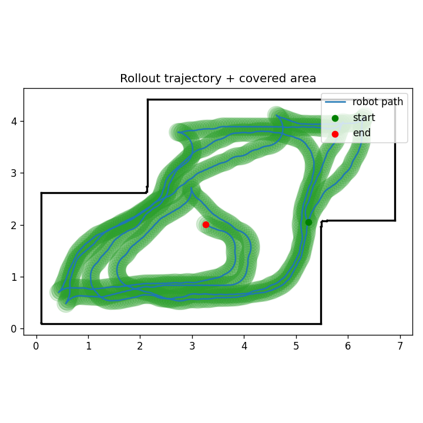
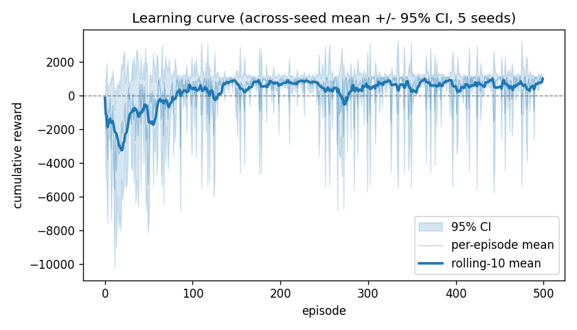
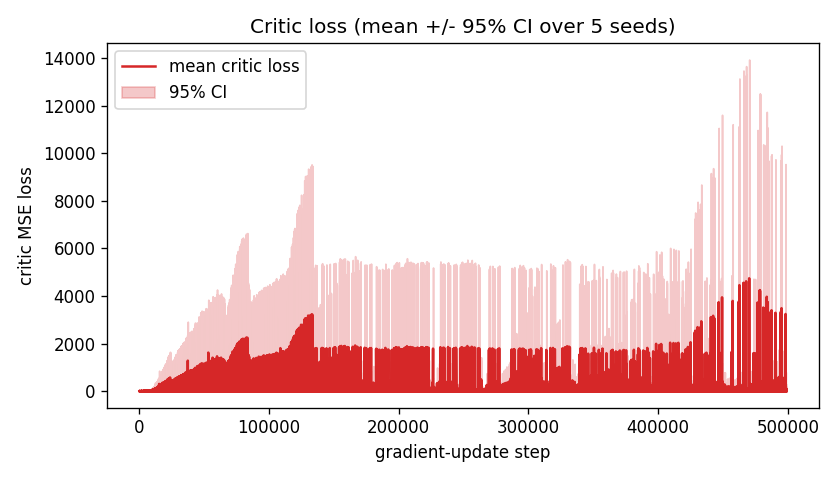

# RoboVacuumDDPG — Continuous Coverage Control with DDPG (from scratch)

Bar-Ilan University — *Vibe Coding & Reinforcement Learning* workshop,
**Assignment 5** (Lecture 09, DDPG). A **DDPG** agent (actor-critic, Polyak
soft-target updates, Gaussian exploration noise, uniform replay buffer) learns
**continuous navigation + area coverage** for a 2D robotic vacuum, driving a
**unicycle** `[throttle, steer]` body across real **HouseExpo** floor-plans. The
simulator and the DDPG algorithm are both built **from scratch** — no Gymnasium,
no Gazebo, no Stable-Baselines3.


> **Status: trained.** 5 sealed seeds `[42, 7, 123, 314, 271]` × 500 episodes on
> the real HouseExpo map `room_single` (≈ 4 h CPU). **Honest result summary:** the
> DDPG agent **learns coverage control on `room_single`** — across-seed
> **691.3 ± 443.1** reward and **≈ 39 % coverage** per episode (one outlier, seed
> 271, did not lock in). It **does *not* yet generalize** to the held-out maps
> (`apt_large` 0.32 %, `office` 0.28 % coverage) — single-map training overfits
> the geometry. Full numbers + the three analysis questions in
> [`docs/ANALYSIS.md`](docs/ANALYSIS.md); committed metrics in
> [`results/metrics_summary.json`](results/metrics_summary.json). Quality gates:
> ruff clean · ≥85 % coverage (`fail_under=85`) · every `.py` ≤150 LOC · `uv` only.

This README **is the submission-report shell** (ex05 deliverables). Section
[3](#3-deliverables-brief-3) collects the graded deliverables; deeper detail
lives in the linked docs. Group code `adrl-001`; cover sheet `adrl-001-ex05.pdf`.

---

## 1. Installation

`uv` only — no `pip`, `conda`, `venv`, or `requirements.txt`.

```bash
# Clone
git clone https://github.com/adirelm/RoboVacuumDDPG
cd RoboVacuumDDPG

# Install (dev deps included)
uv sync --dev

# Fetch HouseExpo floor-plans (clones TeaganLi/HouseExpo at a pinned SHA;
# the full ~35k-JSON dataset is git-ignored, a curated 4–6-plan subset is vendored)
uv run python scripts/fetch_houseexpo.py
```

Secrets (if ever needed) belong in a git-ignored `.env`; `.env-example`
documents the expected keys. The `config/config.yaml` `version` field
(`1.0.0`) is validated at load.

---

## 2. Quick Start / Usage

```bash
uv sync --dev

# ---- Quality gates ----
uv run pytest tests/ --cov=src --cov-report=term-missing   # ≥85% coverage (fail_under=85)
uv run ruff check src/ tests/ scripts/                     # 0 violations
uv run python scripts/check_file_sizes.py                  # every .py ≤150 LOC

# ---- Train (seeded multi-run) ----
uv run python scripts/train.py                             # DDPG training loop (services/trainer.py)

# ---- Reproduce the deliverable figures (after training) ----
uv run python scripts/render_learning_curve.py             # results/figures/learning_curve.png
uv run python scripts/render_critic_loss.py                # results/figures/critic_loss.png
uv run python scripts/render_trajectory.py                 # trajectory over the JSON map
```

All business logic is reachable through the single SDK entry point
`RoboVacuumSDK` (`src/sdk/sdk.py`); the CLI, notebooks, and scripts import only
the SDK — no logic lives in UIs. Public surface:

```python
from src.sdk.sdk import RoboVacuumSDK

sdk = RoboVacuumSDK()                 # reads config/config.yaml via the config loader
env = sdk.build_env()                 # custom VacuumEnv (NO gym) — reset/step 4-tuple
sdk.train()                           # collect → store → update → log
sdk.evaluate()                        # multi-seed / held-out generalization eval
sdk.rollout()                         # one deterministic trajectory (for render_trajectory)
sdk.coverage_report()                 # cleaned-cell % accounting
```

### MDP at a glance (single source of truth: the design spec)

| Element | Definition |
|---|---|
| **Action** | `a ∈ [−1,1]²` = `[throttle, steer]`; Actor is **Tanh**-bounded → exactly [−1,1] |
| **Unicycle** | `v = throttle·v_max`, `ω = steer·omega_max`; `x+=v·cosθ·Δt; y+=v·sinθ·Δt; θ+=ω·Δt` |
| **State** (20-dim, normalized) | **16 lidar ray distances** (/`ray_max`) + current `(v, ω)` + heading cue to nearest uncleaned cell |
| **Reward** | `r = k_coverage·Δcells − k_collision·collision − k_step` |
| **Episode** | ends at `max_steps` (or optional coverage target); `reset()` re-spawns at a random free cell, clears the per-episode coverage grid |

The custom `VacuumEnv.reset()/step(action) -> (state, reward, done, info)` 4-tuple
replaces any Gym API; an AST architecture test **forbids any `gymnasium` import
under `src/`**.

---

## 3. Deliverables (ex05 deliverables)

The three brief-mandated artifacts, generated by the scripts above from the
sealed 5-seed run. Numbers below are read from `results/metrics_summary.json` —
none are invented (spec §10).

### 3.1 Trajectory visualization

`scripts/render_trajectory.py` draws the robot path in colour over the 2D
HouseExpo JSON map, with the covered area shaded — proving wall-avoidance and
smooth continuous coverage. Trained **seed-42** policy on `room_single`
(start = green, end = red, covered area shaded):

> 
> *A smooth, wall-avoiding sweep filling most of the room — the qualitative
> picture behind the ~39 % coverage. Regenerate: `uv run python scripts/render_trajectory.py`.*

### 3.2 Metric graphs (the two required figures)

**Learning curve** — cumulative reward vs. episode, mean ± 95 % CI over the
seeds `[42, 7, 123, 314, 271]`:

> 
> *Deeply negative early (collision-dominated), converging to ≈ +1000 by
> ~episode 130 and holding positive; the wide CI band is the seed-271 spread.
> Regenerate: `uv run python scripts/render_learning_curve.py`.*

**Critic loss** — critic MSE vs. gradient-update step:

> 
> *Bounded throughout (~10² scale, no divergence) — the Polyak-averaged target
> keeps it finite. Regenerate: `uv run python scripts/render_critic_loss.py`.*

### 3.3 The three analysis questions

Answered in full (with our code-line citations) in
[`docs/ANALYSIS.md`](docs/ANALYSIS.md):

1. **Why DDPG, not DQN/PPO?** — deterministic physical motors + continuous
   `[throttle, steer]` control + replay-buffer dataset reuse.
2. **Effect of removing Gaussian exploration noise early** — the coverage map
   collapses to a narrow path.
3. **How target networks + soft updates prevent critic collapse** — Polyak
   averaging `θ_target ← τ·θ + (1−τ)·θ_target` stabilizes the TD target.

DDPG math (objective, deterministic policy gradient, critic TD target, Polyak
update, exploration) lives in [`docs/THEORY.md`](docs/THEORY.md). The summary
points at our own code lines for the Actor (`src/model/actor.py`), Critic
(`src/model/critic.py`), Polyak soft-update and Gaussian noise (`src/ddpg/agent.py`,
`src/ddpg/noise.py`).

---

## 4. Configuration guide

All tunable parameters live in **`config/config.yaml`** (single source of truth,
`version: "1.0.0"`) and are read via `src/utils/config_loader.py` — **no
algorithm value is hardcoded in source**. Local UI/plot styling literals stay
local. The eight blocks:

### `ddpg` — agent hyperparameters (from scratch, Lecture-09 DDPG)

```yaml
ddpg:
  gamma: 0.99            # discount factor γ (justify in docs/ANALYSIS.md)
  tau: 0.005             # Polyak soft-update coefficient τ (brief example value)
  lr_actor: 1.0e-4       # actor learning rate
  lr_critic: 1.0e-3      # critic learning rate (faster than actor — standard DDPG)
  batch_size: 128
  buffer_size: 1000000   # replay capacity
  hidden_sizes: [256, 256]
  grad_clip: 1.0         # gradient-norm clip (stability)
  warmup_steps: 1000     # random actions before learning starts
```

### `noise` — exploration noise (brief mandates **Gaussian**, not OU)

```yaml
noise:
  type: gaussian
  sigma_start: 0.2       # initial Gaussian std added to actions in [-1, 1]
  sigma_end: 0.05
  sigma_decay_steps: 50000
```

### `env` — 2D simulator (from scratch; NO Gymnasium / Gazebo)

```yaml
env:
  n_rays: 16             # lidar rays; ablation knob (8 / 16 / 24)
  ray_max: 5.0           # max lidar range (m); ray distances normalized by this
  dt: 0.1                # kinematic integration timestep (s)
  v_max: 0.5             # max linear velocity (m/s) = throttle * v_max
  omega_max: 1.5         # max angular velocity (rad/s) = steer * omega_max
  robot_radius: 0.17     # vacuum body radius (m)
  clean_radius: 0.17     # cleaning footprint radius (m)
  coverage_cell: 0.10    # coverage grid cell edge (m)
  max_steps: 1000        # steps per episode
```

### `reward` — shaping `r = k_coverage·Δcells − k_collision·hit − k_step`

```yaml
reward:
  k_coverage: 1.0
  k_collision: 10.0
  k_step: 0.01
```

### `training`, `maps`, `paths`, `logging`

```yaml
training:
  episodes: 500
  seeds: [42, 7, 123, 314, 271]

maps:
  dataset_repo: "https://github.com/TeaganLi/HouseExpo"
  dataset_sha: "PINNED_AT_FETCH"     # stamped by scripts/fetch_houseexpo.py
  train: ["room_single", "apt_small", "apt_multi"]
  holdout: ["apt_large", "office"]

paths:
  maps_dir: "data/maps"
  results_dir: "results"

logging:
  level: "INFO"
```

| Block | Controls |
|---|---|
| `ddpg` | `gamma` (0.99), `tau` (0.005), `lr_actor` (1e-4), `lr_critic` (1e-3), `batch_size`, `buffer_size`, `hidden_sizes`, `grad_clip`, `warmup_steps` |
| `noise` | Gaussian `type`, `sigma_start`/`sigma_end`/`sigma_decay_steps` |
| `env` | `n_rays` (16; 8/16/24 ablation), `ray_max`, `dt`, `v_max`, `omega_max`, `robot_radius`, `clean_radius`, `coverage_cell`, `max_steps` |
| `reward` | `k_coverage`, `k_collision`, `k_step` |
| `training` | `episodes`, the 5 seeds `[42, 7, 123, 314, 271]` |
| `maps` | HouseExpo `dataset_repo`/`dataset_sha`, `train` + `holdout` plan lists |
| `paths`, `logging` | I/O directories, log level |

---

## 5. Architecture

Each module is a focused **≤150-LOC** unit; helpers split into sibling `_*.py`
modules before the cap is hit.

```
src/
├── sdk/sdk.py            # RoboVacuumSDK — single business-logic entry
│                         #   (build_env, train, evaluate, rollout, coverage_report)
├── env/
│   ├── house_map.py      # HouseExpo JSON → wall segments + free-space bounds
│   ├── raycast.py        # ray–segment intersection → lidar distances
│   ├── kinematics.py     # unicycle pose integrator
│   ├── coverage.py       # cleaned-cell grid + coverage %
│   ├── collision.py      # robot-radius vs wall-segment collision test
│   ├── reward.py         # r = k_cov·Δcoverage − k_col·collision − k_step
│   ├── state.py          # observation assembly (rays + speed + heading cue)
│   └── vacuum_env.py     # VacuumEnv: reset/step (4-tuple), NO gym
├── model/
│   ├── actor.py          # Actor MLP → Tanh-bounded action
│   └── critic.py         # Critic MLP (state ⊕ action → Q)
├── ddpg/
│   ├── replay_buffer.py  # uniform experience replay
│   ├── noise.py          # Gaussian exploration noise (brief-mandated)
│   └── agent.py          # DDPGAgent: act(), Polyak soft-update(τ), update()
├── services/
│   └── trainer.py        # custom training loop: collect → store → update → log
├── cost/meter.py         # tiktoken/runtime cost accounting
└── utils/config_loader.py
```

No `gymnasium` import exists anywhere under `src/` — enforced by an AST-level
architecture test. Further architecture tests assert: actor action ∈ [−1,1],
soft-update is Polyak, SDK single-entry, config single-source.

---

## 6. Documents

- [`docs/superpowers/specs/2026-06-10-robovacuum-ddpg-design.md`](docs/superpowers/specs/2026-06-10-robovacuum-ddpg-design.md) — design spec (single source of truth)
- `docs/prd/PRD-SIM.md` · `docs/prd/PRD-DDPG.md` · `docs/prd/PRD-HOUSEEXPO.md` — per-subsystem PRDs
- `docs/PLAN.md` (C4 + UML + ADRs) · `docs/TODO.md` (phased + DoD)
- [`docs/THEORY.md`](docs/THEORY.md) — DDPG objective, deterministic policy gradient, critic TD target, Polyak update
- [`docs/ANALYSIS.md`](docs/ANALYSIS.md) — the 3 required analysis questions
- `docs/COST_ANALYSIS.md` · `docs/QUALITY.md` (ISO 25010) · `docs/UX.md` (CLI/figures) · `docs/PROMPTS.md`
- `docs/adr/` — ADR-001 (no Gym/Gazebo) · ADR-002 (unicycle) · ADR-003 (Gaussian not OU) · ADR-004 (coverage grid) · ADR-005 (HouseExpo adapter) · ADR-006 (reward shaping) · ADR-007 (net sizing + τ) · ADR-008 (multi-seed + held-out generalization)

---

## 7. Contributing

This is a course assignment, but it follows professional standards (see
[`CLAUDE.md`](CLAUDE.md) and the V3 submission guidelines). Before any change:

```bash
uv sync --dev
uv run pytest tests/ --cov=src --cov-report=term-missing   # must pass, coverage ≥85%
uv run ruff check src/ tests/ scripts/                     # zero violations
uv run ruff format src/ tests/ scripts/                    # auto-format
uv run python scripts/check_file_sizes.py                  # every .py ≤150 LOC
```

Standards: **TDD** (RED→GREEN→REFACTOR, test before/with code), **OOP** via the
`RoboVacuumSDK` single entry point, **DRY** (extract at the second copy), every
`.py` **≤150 lines** (tests included), docstrings on every public
function/class/module, and **`uv` only** (no `pip` / `conda` / `venv` /
`requirements.txt`). All algorithm-relevant values live in `config/config.yaml`.
Work on the `main` branch lineage via a feature branch and open a PR for review;
share read access with `@rmisegal`.

---

## 8. References

- Lillicrap et al. 2016 — *Continuous Control with Deep Reinforcement Learning* (DDPG)
- Silver et al. 2014 — *Deterministic Policy Gradient Algorithms*
- Li et al. 2019 — *HouseExpo: A Large-scale 2D Indoor Layout Dataset* (arXiv:1903.09845)

---

## 9. License & Credits

MIT — see [LICENSE](LICENSE). Built **from scratch** on PyTorch (DDPG networks),
NumPy, and Matplotlib (figures); HouseExpo floor-plans courtesy of
[`TeaganLi/HouseExpo`](https://github.com/TeaganLi/HouseExpo) (Li et al. 2019).
No Gymnasium, no Gazebo, no Stable-Baselines3 — the simulator and the DDPG
algorithm are our own code. Managed with `uv`. Course: Bar-Ilan *Vibe Coding &
RL* workshop (Dr. Yoram Segal). Group code `adrl-001`; submission cover sheet
`adrl-001-ex05.pdf` (the public repo claims no numeric self-grade).
