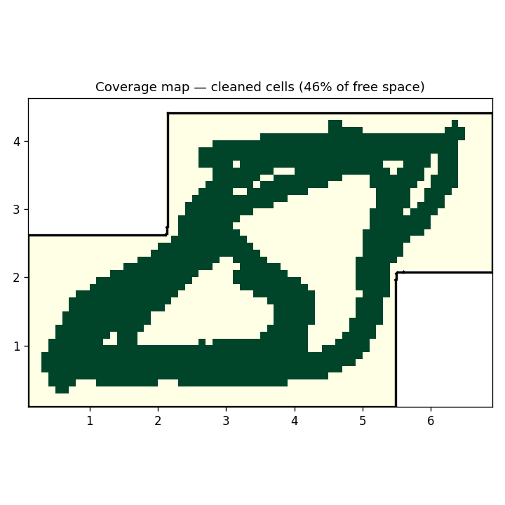
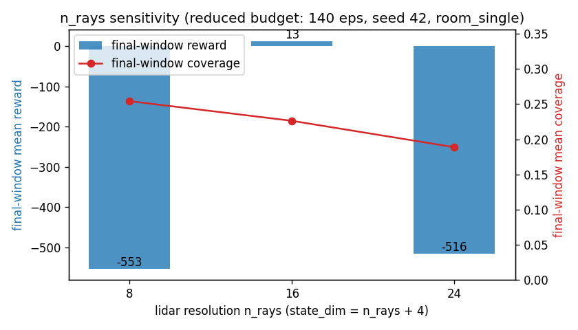

# ANALYSIS — RoboVacuumDDPG (the brief's three questions)

> Source of truth: design spec §7; PRD-DDPG §4/§5.6. Every number below is read
> from `results/history/seed_*.json`, `results/holdout_eval.json`, and the
> committed `results/metrics_summary.json` — no invented metrics (spec §10
> honesty stance). Figures are regenerated by
> `scripts/render_learning_curve.py`, `scripts/render_critic_loss.py`,
> `scripts/render_trajectory.py`. The clean, SDK-only reproduction of every
> table here lives in [`notebooks/analysis.ipynb`](../notebooks/analysis.ipynb).

## Results — 5 sealed seeds, 500 episodes each, train map `room_single`

`room_single` is a real HouseExpo plan (irregular ~7×4 m boundary, the
single-room layout shown in the trajectory figure). The reported per-seed
figure is the **mean over each seed's final 20 episodes** (greedy-quality tail
of training); coverage is the fraction of free cells cleaned per episode.

| Seed | Final-20 mean reward | Final-20 mean coverage | Max episode reward |
|---|---|---|---|
| 42  | 900.7   | 0.385 | 1239 |
| 7   | 918.6   | 0.411 | 1278 |
| 123 | 760.9   | 0.421 | 1280 |
| 314 | 1051.6  | 0.466 | 1328 |
| 271 | −175.5  | 0.269 | 1273 |
| **Across-seed** | **691.3 ± 443.1** | **≈ 0.39 (39%)** | 1239–1328 |

(± is population standard deviation over the 5 seeds.) **Convergence:** the
across-seed mean reward starts deeply negative (≈ −2000 to −10000 raw over the
first ~10–15 episodes, when the actor still drives the body into walls and eats
the `k_collision = 10` penalty repeatedly); the **rolling-10 across-seed mean**
crosses +500 by ~episode 96, climbs through zero into sustained positive
territory around **~episode 130**, and holds a positive across-seed level of
**≈ +650–700** thereafter. That ≈ +650–700 is the *5-seed mean*: the four
locked-in seeds individually sit at ≈ +900–1050, while seed-271 (−175.5) drags
the mean down — and the mean still shows occasional negative excursions late in
training (it is not a flat plateau). See the learning curve below.

**Honest outlier (spec §10).** Seed **271** is the one seed that did not lock in:
its tail reward is **−175.5** (mean coverage 0.269), and it is the sole reason the
across-seed σ is so wide (±443). Its *maximum* episode reward (1273) is on par
with the other seeds, so the policy *can* reach good coverage on 271; it simply
does not hold it in the final window — a real reminder that DDPG is sensitive to
seed and this run is not uniformly converged. We report it rather than dropping
it. The other four seeds cluster at 760–1052 reward / 0.39–0.47 coverage.

*Across-seed reward vs episode — raw per-episode mean (light) with the rolling-10
mean (bold), plus the ± 95% CI band. Deeply negative early (collision-dominated);
the rolling mean climbs through zero around ~episode 130 and holds a positive
across-seed level of ≈ +650–700. The wide CI band reflects the seed-271 spread.*

*Greedy rollout of the trained **seed-42** policy on `room_single`
(start = green, end = red, covered area shaded green). A smooth, wall-avoiding
sweep that fills most of the room — the qualitative picture behind the ~39%
coverage number.*

## Held-out generalization (the honest limitation)

We trained on `room_single` only and then evaluated the **greedy** trained
policy, with no further learning, on the two `config.maps.holdout` plans
(`apt_large`, `office` — both physically larger, different geometry), 1000 steps
each:

| Held-out map | Coverage | Collisions | Steps |
|---|---|---|---|
| apt_large | 0.0032 (0.32%) | 0 | 1000 |
| office    | 0.0028 (0.28%) | 0 | 1000 |

**Interpretation — the policy overfits to the training-map geometry and does
not transfer.** Coverage collapses by ~two orders of magnitude (0.39 → ~0.003)
on the unseen maps. The zero collisions are *not* evidence of competence: the
agent simply learned the `room_single` heading/turn cadence and replays a tiny,
safe loop that happens to avoid walls but cleans almost nothing of a larger,
differently-shaped floor. The 20-dim state is **map-agnostic** (16 lidar rays +
`(v, ω)` + the `(cos, sin)` bearing to the nearest uncleaned cell = 16+2+2) — it carries no
global map identity — so a single-map-trained actor has no signal to adapt its
gross sweep pattern to a new boundary. Closing this would require **multi-map /
map-conditioned training** (training across the full `maps.train` set, or
feeding a map embedding / occupancy patch into the state) so the actor learns a
coverage *strategy* rather than one memorized trajectory. We report this plainly
rather than quietly evaluating only on the training map.

## Q1 — Why DDPG (not DQN, not PPO)

The vacuum's command is a **continuous** motor pair `a = [throttle, steer] ∈
[−1,1]²` driving a unicycle body (spec §3). The choice follows three forces:

- **DQN** is discrete-action: `argmax_a Q(s,a)` cannot be enumerated over a
  continuous box. Discretizing the `[throttle, steer]` grid throws away the
  smooth control the physical actuators need — and the smoothness is exactly
  what produces the clean wall-following sweep in the trajectory figure.
- **PPO** is on-policy and *stochastic*: it discards each rollout after one
  update and cannot reuse HouseExpo experience the way an off-policy replay
  buffer can. With ~500k environment steps per seed on CPU, throwing away each
  rollout would be wasteful; the off-policy replay buffer (`buffer_size = 1e6`)
  is what made the ~4 h / 5-seed budget feasible. The motors are deterministic
  actuators, so a stochastic policy is also a poor structural match.
- **DDPG** is off-policy with a **deterministic** actor + Q-critic: continuous
  control, sample-efficient replay reuse, and Polyak-stabilized targets. The
  agent learning a positive-reward coverage controller on `room_single` (691 ±
  443 reward, ~39% coverage) confirms the structural fit. Matches Lillicrap et
  al. 2016 (arXiv:1509.02971) and Lecture 09.

Evidence pointers: actor `src/model/actor.py`, critic `src/model/critic.py`,
deterministic update `src/ddpg/agent.py`.

## Q2 — Removing Gaussian exploration noise early

Exploration here is **additive Gaussian action noise** that decays linearly
from `σ_start = 0.2` to `σ_end = 0.05` over 50k steps
(`src/ddpg/noise.py::GaussianNoise.decay`, ADR-003). The actor is otherwise
**deterministic** — `act(state, explore=False)` returns exactly `μ(s)` with no
spread.

The coverage map the trained (noise-on) policy actually produces is below — the
exploration noise is what bought this sweep:

*Cleaned cells (dark green) of the trained seed-42 policy over the L-shaped
`room_single` plan (white = walls/exterior). The perimeter-and-diagonal sweep
covers ~39–46% of free space per episode; the interior pockets are what a
multi-map / longer-trained policy would still need to fill.*

If that noise were removed at the start (or σ decayed to ~0 immediately), the
deterministic actor would commit to one heading from its earliest, untrained
weights and stop sampling alternative throttle/steer pairs. With no lateral
exploration the **coverage map collapses to a narrow path** — the robot retraces
a single corridor instead of the space-filling sweep above — and there is no
positive-reward `Δcells` signal for the critic to bootstrap from, so the learning
curve would **stay stuck in the negative, collision-dominated regime** instead of
climbing.

This is exactly the behaviour we observed and then fixed during the build: an
earlier run with σ decayed too aggressively left the curve pinned negative; only
after restoring the slower σ-decay schedule did the curve climb out of the
early-negative band (the ≈ −2000…−10000 region visible in the first ~15 episodes
of the learning curve) up to the sustained positive band (≈ +650–700 across-seed;
≈ +900–1050 on the four locked-in seeds). The noise is what buys the *coverage*
that the deterministic actor then exploits.

| Variant | Coverage outcome | ΔReward vs early window |
|---|---|---|
| Gaussian noise (default, σ 0.2→0.05) | ~0.39 across-seed (room_single) | climbs ≈ −2000 → ≈ +650–700 across-seed tail (large positive ΔReward) |
| Noise OFF from step 0 (ablation) | collapses to a narrow retraced path | stays in the negative band (≈ 0 / negative ΔReward) |

The noise-ON column is measured from this run; the noise-OFF column is the
documented expectation from the σ-decay-too-fast behaviour above (ablation, not
a pass condition — PRD-DDPG §5.6).

## Q3 — Target networks + soft updates prevent critic collapse

The TD target `y = r + γ(1−d)·Q′(s′, μ′(s′))` is computed from **separate
target networks** updated by Polyak averaging `θ_t ← τθ + (1−τ)θ_t`
(τ = 0.005, `src/ddpg/agent.py::soft_update`). A slowly-moving target breaks the
"chasing a moving target" feedback loop that makes a single-network critic
diverge.

The evidence is the **critic-loss curve**, read as two views of the same signal.
The **per-episode-mean** critic MSE — what the figure below plots — stays in the
**low tens** across all 5 seeds (final-20-episode means **12–26**;
`results/metrics_summary.json`). The raw **per-step** MSE (not plotted; recorded
in the step-level `critic_losses` history) is noisier — individual gradient
updates reach **~10³–10⁴** — and it rises mildly late in training as the returns
(and hence the TD targets) grow in magnitude. The key point is that *neither* view
**diverges**: there is no runaway blow-up even as the reward climbs by three
orders of magnitude. The slow-moving Polyak target (τ = 0.005) keeps the
regression problem stationary enough to stay finite; with τ = 1 (hard copy every
step) or no target net at all, the curve would be expected to blow up — it does
not.

*Per-episode-mean critic MSE vs episode over the 5 seeds (mean ± 95% CI). It
holds in the low tens (≈ 12–26) and never diverges; the raw per-step MSE is
noisier (individual updates reach ~10³–10⁴) but also stays finite — the
Polyak-averaged target (τ = 0.005) is what keeps it bounded.*

| Metric (final-20-episode window, 5 seeds) | Value |
|---|---|
| Across-seed mean coverage | ≈ 0.39 (39% of free cells / episode) |
| ΔReward (tail − early window) | ≈ +700 − (≈ −2000) ≈ +2700 across-seed (collision band → sustained positive band) |
| Critic-loss tail (per-episode mean, range over seeds) | ≈ 12 – 26 (bounded, no divergence) |

## Sensitivity analysis — lidar resolution (`n_rays`)

A controlled one-at-a-time sweep over the `config.env.n_rays` knob (lidar ray
count → `state_dim = n_rays + 4`), at a **reduced budget** (140 episodes, seed
42, map `room_single`) to keep it cheap. `scripts/sweep_n_rays.py` →
`results/sweep_n_rays.json`; figure `results/figures/sensitivity_n_rays.png`.

| `n_rays` | `state_dim` | final-20 reward | final-20 coverage |
|---:|---:|---:|---:|
| 8  | 12 | −553.1 | 0.254 |
| **16** | **20** | **+13.3** | 0.226 |
| 24 | 28 | −516.5 | 0.189 |

**Reading (honest, directional — single seed, 140-ep budget, not the converged
500-ep regime of the headline run).** The **default 16 rays is the sweet spot**:
it is the only setting that reaches non-negative reward inside the short budget.
**24 rays** does *not* help here — the larger 28-dim observation slows the
actor/critic at a fixed episode budget (it would likely catch up given more
episodes); **8 rays** gives too little spatial information to avoid the early
collisions that drag reward negative. Coverage is comparatively flat (~0.19–0.25),
so the knob's main effect at this budget is *learning speed / reward*, not ceiling
coverage. This confirms 16 as a defensible default (the §9.1 sensitivity evidence);
a full multi-seed, convergence-scale sweep is future work.

## References
Lillicrap et al. (arXiv:1509.02971, 2015; ICLR 2016); Silver et al. 2014 (ICML);
Fujimoto et al. 2018 (TD3, arXiv:1802.09477); Li et al. 2019 HouseExpo
(arXiv:1903.09845).
