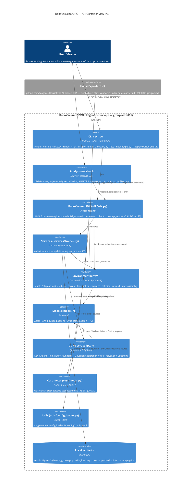

# PLAN — architecture & design (RoboVacuumDDPG)

Design/architecture doc for **Assignment 5** — *DDPG over a from-scratch
2D robotic-vacuum simulator that reads real HouseExpo floor-plans*. Single
source-of-truth aggregating layering, the C4 container view, component
responsibilities, the MDP contract, the `VacuumEnv` / `RoboVacuumSDK`
interface surface, and the ADR registry. Mirrors the A4 PLAN structure so
the grader audit transfers. Every value below is quoted verbatim from
`docs/superpowers/specs/2026-06-10-robovacuum-ddpg-design.md` (the spec)
and `config/config.yaml`.

> **Scope note (honesty).** A from-scratch 2D vacuum simulator + a
> from-scratch PyTorch DDPG agent over a curated 4–6-plan HouseExpo
> subset — not a population study over the full ~35k corpus. Four
> caveats: (1) HouseExpo full corpus (~35k JSON) is git-ignored — we
> vendor only a curated subset under `data/maps/`; (2) the lidar is a
> 2D ray–segment raycast against wall segments, not a sensor model;
> (3) reward weights `k_coverage`/`k_collision`/`k_step` are calibrated,
> not derived; (4) if training convergence is partial under the compute
> time-box, we report honestly (A4 convention, spec §10).

## §1 — Architecture (C4-Container, mermaid)

> **Simulator-from-scratch ban (brief §"דרישת חובה", spec §1).** The
> brief mandates **no ready simulation platforms — no Gymnasium, no
> Gazebo** — and (by the "show your Polyak code lines" demand) **no ready
> RL library — no SB3**. DDPG is implemented from scratch in PyTorch.
> Enforced by an **AST architecture test** that forbids any `gymnasium`
> import under `src/` (spec §3, §8). `VacuumEnv` exposes a custom Python
> `reset()/step(action)` API returning a **4-tuple** `(state, reward,
> done, info)`; there is no `gymnasium.Env` base class.

**Context.** One user (or grader) drives RoboVacuumDDPG; the only external
system is the **HouseExpo** floor-plan dataset (`github.com/TeaganLi/HouseExpo`,
cloned once at a pinned commit by `scripts/fetch_houseexpo.py`, full corpus
git-ignored, curated subset vendored under `data/maps/`). No network at
train/eval time, no DB, no inference server, no auth surface.

**Containers / layers** (External → SDK → Services → Domain → Infrastructure):



**Dependency rule.** Arrows point downward only — **the CLI, scripts, and
notebook import ONLY the SDK** (`RoboVacuumSDK`), never `env`, `model`,
`ddpg`, or `services` directly (CLAUDE.md §3, spec §8 "SDK single-entry").
An architecture test enforces this single-entry seam alongside the
`gymnasium`-import ban and the config-single-source check.

## §2 — Component responsibilities

Every `src/**/*.py` ≤ **150 code lines** (CLAUDE.md §1, spec §2). If
`vacuum_env.py` or `agent.py` approaches 150 LOC, helpers split into a
sibling `_*.py` module (A4 convention, spec §4). The `src/` layout below
matches the spec §4 tree **exactly**.

| Layer | Modules (under `src/`) | Responsibility | Forbidden |
|---|---|---|---|
| **sdk** | `sdk/sdk.py` | `RoboVacuumSDK` — single business-logic façade: `build_env`, `train`, `evaluate`, `rollout`, `coverage_report`. The **only** import surface for CLI / scripts / notebook | No training math inline; no `print()`; no UI |
| **env / house_map** | `env/house_map.py` | Parse a HouseExpo JSON floor-plan → wall **segments** + free-space bounds | No torch; no RL logic; no env stepping |
| **env / raycast** | `env/raycast.py` | Ray–segment intersection → **16 lidar ray distances** (`n_rays` knob: 8/16/24), clipped to `ray_max=5.0`, normalized by `ray_max` | No torch; no pose mutation; no reward |
| **env / kinematics** | `env/kinematics.py` | Unicycle pose integrator: `v = throttle·v_max`, `ω = steer·omega_max`, `x+=v·cosθ·Δt; y+=v·sinθ·Δt; θ+=ω·Δt` (`v_max=0.5`, `omega_max=1.5`, `dt=0.1`) | No collision test; no raycast; no reward |
| **env / coverage** | `env/coverage.py` | Cleaned-cell grid (`coverage_cell=0.10` m edge, `clean_radius=0.17` m footprint) + coverage %; per-episode reset | No pose integration; no torch |
| **env / collision** | `env/collision.py` | Robot-radius (`robot_radius=0.17` m) vs wall-segment collision test → bool hit | No pose integration; no reward weighting |
| **env / reward** | `env/reward.py` | `r = k_coverage·Δcells − k_collision·hit − k_step` (`k_coverage=1.0`, `k_collision=10.0`, `k_step=0.01`) | No torch; no pose/coverage mutation — reads deltas only |
| **env / state** | `env/state.py` | Observation assembly (20-dim, all normalized): 16 lidar distances ⊕ current `(v, ω)` ⊕ heading cue to nearest uncleaned cell | No reward; no pose integration; no torch training |
| **env / vacuum_env** | `env/vacuum_env.py` | `VacuumEnv`: `reset()` (re-spawn robot at random free cell, clear coverage grid) / `step(action)` → **4-tuple** `(state, reward, done, info)`; episode ends at `max_steps=1000` or coverage target | **No `gymnasium` import (AST-checked)**; no model training; no UI; no disk I/O on hot path |
| **model / actor** | `model/actor.py` | Actor MLP (`hidden_sizes=[256,256]`) → **Tanh-bounded** action ∈ `[−1,1]²` | No env access; no training loop; no I/O; no replay buffer |
| **model / critic** | `model/critic.py` | Critic MLP — takes **state AND action** (`state⊕action → Q`) | No env access; no action bounding; no training loop |
| **ddpg / replay_buffer** | `ddpg/replay_buffer.py` | Uniform experience replay (`buffer_size=1000000`, sample `batch_size=128`) | No network forward; no reward computation |
| **ddpg / noise** | `ddpg/noise.py` | **Gaussian** exploration noise added to actor action during collection (`sigma_start=0.2` → `sigma_end=0.05` over `sigma_decay_steps=50000`) — **NOT OU** (spec §5, ADR-003) | No OU process; no network code; no replay access |
| **ddpg / agent** | `ddpg/agent.py` | `DDPGAgent`: `act()` (actor + Gaussian noise), `update()` (critic TD + DPG actor step, `grad_clip=1.0`), **Polyak soft-update(τ)** `θ_target = τ·θ + (1−τ)·θ_target` for both actor & critic targets (`τ=0.005`, `γ=0.99`, `lr_actor=1e-4`, `lr_critic=1e-3`) | No env stepping; no direct user I/O; no figure rendering |
| **services / trainer** | `services/trainer.py` | Custom training loop: **collect → store → update → log**; `warmup_steps=1000` random actions before learning; multi-seed (`seeds=[42,7,123,314,271]`), `episodes=500` (no in-loop eval cadence — full per-episode history returned, final eval via `RoboVacuumSDK.evaluate`) | No `gymnasium`; no SB3; no direct user I/O |
| **cost** | `cost/meter.py` | `RuntimeMeter` — wall-clock + step/episode cost accounting (V3 §11 (Costs)) | No RL logic; no env stepping |
| **utils** | `utils/config_loader.py` | Single-source loader for `config/config.yaml` (CLAUDE.md §4) | No business logic; no hardcoded algorithm values |

DRY-shared helpers live in sibling `_*.py` modules (e.g. `env/_*.py`,
`ddpg/_*.py`) per the A4 convention (CLAUDE.md §5, spec §4).

## §3 — MDP definition (the contract every env unit satisfies)

Quoted from spec §3; defaults from `config/config.yaml`.

- **Action** `a ∈ [−1,1]²` = `[throttle, steer]`. **Unicycle model:**
  linear velocity `v = throttle·v_max` (`v_max=0.5` m/s), angular velocity
  `ω = steer·omega_max` (`omega_max=1.5` rad/s); pose integrated with
  `dt=0.1` s as `x += v·cosθ·Δt; y += v·sinθ·Δt; θ += ω·Δt`. The Actor's
  output layer is **Tanh**, so the raw action is bounded to exactly
  `[−1,1]` (no clamp needed). (ADR-002 unicycle model.)
- **State** (~**20-dim**, all normalized):
  - **16 lidar ray distances** — `env/raycast.py` casts `n_rays=16` rays
    to wall segments, each distance `/ ray_max` (`ray_max=5.0`). `n_rays`
    is a `config` knob (8/16/24) to enable a **sensor-resolution ablation**.
  - current `(v, ω)` — 2 dims.
  - a **heading cue** = `cos`/`sin` of the bearing to the nearest uncleaned
    cell in the robot frame — 2 dims, a **unit vector** (not a raw angle) so
    it is continuous with no ±π wraparound (fixed representation, emitted
    unconditionally by `state.py` — no config switch).
  - ⟹ 16 + 2 + 2 = **20 dims** (pinned; `state_dim = n_rays + 4`).
- **Reward**: `r = k_coverage·(new cells cleaned) − k_collision·(collision)
  − k_step`, with config defaults `k_coverage=1.0`, `k_collision=10.0`,
  `k_step=0.01`. (ADR-006 reward shaping; reward-sign unit tests verify
  each term flips reward in the expected direction.)
- **Episode**: ends at `max_steps=1000` **or** an optional coverage
  target; `reset()` re-spawns the robot at a random free cell and clears
  the per-episode coverage grid.
- **No Gymnasium**: custom `VacuumEnv.reset() / step(action) →
  (state, reward, done, info)`; an AST architecture test forbids any
  `gymnasium` import under `src/` (spec §3, §8).

> **State dim is pinned at 20.** Heading cue = 2-component unit vector
> (`cos`/`sin`), so `state_dim = n_rays + 2 (v, ω) + 2 = 20` at the default
> `n_rays=16`. `env/state.py` builds it and a shape unit test
> (`test_state_dim_is_20`) pins it; with `n_rays ∈ {8,24}` the dim is `n_rays+4`.

## §4 — Hyperparameter tree

Every algorithm-relevant knob lives in `config/config.yaml`
(CLAUDE.md §4, spec §2/§5). Local UI styling (matplotlib DPI / alpha /
fontsize) stays in its rendering script. Tree shape (authoritative —
excerpt; see the file for full):

```yaml
# config/config.yaml (authoritative — version "1.0.0")
version: "1.0.0"

ddpg:
  gamma: 0.99            # discount factor γ (justify in docs/ANALYSIS.md)
  tau: 0.005             # Polyak soft-update coefficient τ (brief example value)
  lr_actor: 1.0e-4       # actor learning rate
  lr_critic: 1.0e-3      # critic learning rate (faster than actor — standard DDPG)
  batch_size: 128
  buffer_size: 1000000   # replay capacity
  hidden_sizes: [256, 256]
  grad_clip: 1.0         # gradient-norm clip (stability)
  warmup_steps: 1000     # random actions before learning starts

noise:                   # brief mandates GAUSSIAN, not OU (ADR-003)
  type: gaussian
  sigma_start: 0.2       # initial Gaussian std added to actions in [-1, 1]
  sigma_end: 0.05
  sigma_decay_steps: 50000

env:                     # 2D simulator from scratch — NO Gymnasium / Gazebo
  n_rays: 16             # lidar rays; ablation knob (8 / 16 / 24)
  ray_max: 5.0           # max lidar range (m); ray distances normalized by this
  dt: 0.1                # kinematic integration timestep (s)
  v_max: 0.5             # max linear velocity (m/s) = throttle * v_max
  omega_max: 1.5         # max angular velocity (rad/s) = steer * omega_max
  robot_radius: 0.17     # vacuum body radius (m)
  clean_radius: 0.17     # cleaning footprint radius (m)
  coverage_cell: 0.10    # coverage grid cell edge (m)
  max_steps: 1000        # steps per episode

reward:                  # r = k_coverage*Δcells - k_collision*hit - k_step
  k_coverage: 1.0
  k_collision: 10.0
  k_step: 0.01

training:
  episodes: 500
  seeds: [42, 7, 123, 314, 271]

maps:                    # full ~35k git-ignored; curated subset vendored
  dataset_repo: "https://github.com/TeaganLi/HouseExpo"
  dataset_sha: "45e2b2505f6ea1fe49c0203f14efb7ce20b94e7c"   # pinned HouseExpo commit (stamped by scripts/fetch_houseexpo.py)
  train: ["room_single", "apt_small", "apt_multi"]
  holdout: ["apt_large", "office"]

paths:
  maps_dir: "data/maps"
  results_dir: "results"
```

**Brief-mandated DDPG knobs** (`gamma=0.99`, `tau=0.005`, `lr_actor`,
`lr_critic`, `noise.sigma_*`, `batch_size`, `buffer_size`, `hidden_sizes`)
are all config-sourced and **justified in `docs/THEORY.md` / `docs/ANALYSIS.md`**
(spec §5.3, §7). The **Gaussian** noise type is asserted in a test (no OU —
ADR-003). `n_rays` drives the sensor-resolution ablation (ADR-008).

## §5 — DDPG training loop sketch

Pseudocode below is the contract `services/trainer.py` + `ddpg/agent.py`
jointly satisfy. The from-scratch loop is **collect → store → update →
log** (spec §4). Polyak math and the actor Tanh-bound are unit-tested
(spec §8).

```python
# services/trainer.py + ddpg/agent.py (sketch — real files ≤150 LOC each)
def train(env, agent, cfg, seeds):                 # seeds = [42, 7, 123, 314, 271]
    for seed in seeds:
        set_global_seed(seed)
        state = env.reset()                        # re-spawn at random free cell
        for step in range(cfg.training.episodes * cfg.env.max_steps):
            if step < cfg.ddpg.warmup_steps:       # 1000 random actions first
                action = sample_random_action()    # in [-1, 1]^2
            else:
                action = agent.act(state)          # Actor(state) + Gaussian noise σ(step)
            next_state, reward, done, info = env.step(action)   # 4-tuple, NO gym
            buffer.store(state, action, reward, next_state, done)
            state = env.reset() if done else next_state
            if len(buffer) >= cfg.ddpg.batch_size and step >= cfg.ddpg.warmup_steps:
                batch = buffer.sample(cfg.ddpg.batch_size)      # uniform, 128
                # --- critic update: TD target with target nets ---
                with torch.no_grad():
                    a_next = actor_target(batch.next_state)     # Tanh-bounded
                    q_next = critic_target(batch.next_state, a_next)
                    y = batch.reward + cfg.ddpg.gamma * (1 - batch.done) * q_next
                critic_loss = F.mse_loss(critic(batch.state, batch.action), y)
                optim_critic.zero_grad(); critic_loss.backward()
                nn.utils.clip_grad_norm_(critic.parameters(), cfg.ddpg.grad_clip)
                optim_critic.step()
                # --- actor update: deterministic policy gradient ---
                actor_loss = -critic(batch.state, actor(batch.state)).mean()
                optim_actor.zero_grad(); actor_loss.backward()
                nn.utils.clip_grad_norm_(actor.parameters(), cfg.ddpg.grad_clip)
                optim_actor.step()
                # --- Polyak soft target update (brief code-requirement) ---
                soft_update(actor_target, actor, cfg.ddpg.tau)    # θ_t = τθ + (1-τ)θ_t
                soft_update(critic_target, critic, cfg.ddpg.tau)  # τ = 0.005
            log_metrics(reward=reward, critic_loss=critic_loss)   # → learning_curve / critic_loss
```

Key invariants tested in `tests/` (spec §8):
- **Polyak math** — `soft_update` produces `τ·θ + (1−τ)·θ_target` exactly.
- **Actor Tanh-bounds** — actor output ∈ `[−1,1]²` for any input.
- **Critic output shape** — `critic(state, action)` returns a scalar Q.
- **Replay sampling shapes** — `sample(128)` returns correct tensor shapes.
- **Gaussian noise seeding** — noise is reproducible under a fixed seed; type is Gaussian (not OU).
- **One finite update step** — a single `update()` produces finite losses.
- **Deterministic sim units** — raycast geometry, kinematics integration, coverage accounting, collision, reward signs, HouseExpo loader (hand-computed expectations).
- **Architecture** — no `gymnasium` import in `src/`; actor action ∈ `[−1,1]`; soft-update is Polyak; SDK single-entry; config single-source.
- Training itself = a short **smoke test**; **≥85% coverage** on the deterministic core; ruff clean; all files ≤150 LOC.

## §6 — Interface contracts

### `VacuumEnv` — custom Python API (NO Gymnasium)

```python
class VacuumEnv:
    def reset(self) -> state:
        """Re-spawn robot at a random free cell; clear the per-episode
        coverage grid. Returns the 20-dim normalized state."""

    def step(self, action) -> tuple[state, reward, done, info]:
        """action = [throttle, steer] ∈ [-1, 1]^2 (4-TUPLE return — spec §3).
        Integrates unicycle pose (kinematics), recomputes lidar (raycast),
        updates coverage grid, tests collision, computes
        r = k_coverage·Δcells − k_collision·hit − k_step. done at
        max_steps=1000 or coverage target. NO gymnasium base class."""
```

### `RoboVacuumSDK` — single business-logic entry point (spec §4)

```python
class RoboVacuumSDK:
    def build_env(self, map_name) -> VacuumEnv:
        """Load a HouseExpo plan from data/maps/ (house_map.py) and
        construct a VacuumEnv with config-sourced parameters."""

    def train(self, seed) -> TrainReport:
        """Run the custom DDPG training loop (services/trainer.py):
        collect → store → update → Polyak soft-update(τ) → log.
        Emits learning_curve / critic_loss series."""

    def evaluate(self, checkpoint) -> EvalReport:
        """Greedy (noise-free) actor rollout; coverage % over the
        held-out maps (apt_large, office) for generalization."""

    def rollout(self, ...) -> Trajectory:
        """Roll the (optionally greedy) policy and return the robot path
        for render_trajectory.py."""

    def coverage_report(self, ...) -> CoverageReport:
        """Coverage-grid summary (cleaned %, per-cell map)."""
```

> CLI, scripts (`render_learning_curve.py`, `render_critic_loss.py`,
> `render_trajectory.py`, `fetch_houseexpo.py`), and the notebook are
> **consumers of `RoboVacuumSDK` only** — they never import `env`,
> `model`, `ddpg`, or `services` directly (CLAUDE.md §3). Dataclass
> reports (`TrainReport`, `EvalReport`, …) cross the boundary, never raw
> dicts (A4 convention).

## §7 — Deliverables (spec §7)

| ID | Artifact | Source script | Definition |
|---|---|---|---|
| **D1** | `results/figures/learning_curve.png` | `render_learning_curve.py` | Cumulative reward vs episode, **mean ± CI over seeds** (`seeds=[42,7,123,314,271]`) |
| **D2** | `results/figures/critic_loss.png` | `render_critic_loss.py` | Critic loss vs training step |
| **D3** | Trajectory visualization (PNG; optional short MP4/GIF) | `render_trajectory.py` | Robot path in colour over the 2D JSON map (covered area shaded) — proves wall-avoidance + smooth continuous coverage |
| **D4** | `docs/ANALYSIS.md` | — | Answers the brief's **3 analysis questions**: (1) why DDPG not DQN/PPO (deterministic physical motors + continuous control + dataset reuse); (2) effect of removing Gaussian exploration noise early (coverage map collapses to a narrow path); (3) how target networks + soft updates prevent critic collapse |
| **D5** | `docs/THEORY.md` | — | DDPG objective, deterministic policy gradient, critic TD target, Polyak update, exploration — LaTeX + citations (incl. HouseExpo: Li et al. 2019, arXiv:1903.09845) |
| **D6** | HouseExpo subset under `data/maps/` | `scripts/fetch_houseexpo.py` | Clone `github.com/TeaganLi/HouseExpo` at a **pinned commit** (`dataset_sha` stamped at fetch); vendor 4–6 curated plans (`train`: room_single, apt_small, apt_multi; `holdout`: apt_large, office); full ~35k JSON git-ignored |

## §8 — ADR registry (8 ADRs)

ADRs live in `docs/adr/` and follow *Context → Decision → Consequences*.
Titles are taken **verbatim** from spec §9.

| ADR | Title | Why it matters |
|---|---|---|
| **ADR-001** | Simulator-from-scratch boundary (no Gym/Gazebo) | The brief bans ready simulation platforms and (by the "show your Polyak code lines" demand) ready RL libraries (no SB3). Pins the from-scratch boundary; enforced by the AST `gymnasium`-import ban under `src/` and the custom `VacuumEnv` 4-tuple API. |
| **ADR-002** | Unicycle kinematic model | Fixes the motion model: `v = throttle·v_max`, `ω = steer·omega_max`, Euler-integrated pose with `dt`. Continuous `[throttle, steer]` action is exactly what DDPG (continuous control) is for — motivates the algorithm choice. |
| **ADR-003** | Gaussian (not OU) exploration noise | The brief mandates **Gaussian** exploration noise added to the actor action during collection (`sigma_start=0.2` → `sigma_end=0.05` over `sigma_decay_steps`). Pins the noise type so a test can assert it (no OU process). |
| **ADR-004** | Coverage-grid representation + cleaning radius | Defines the cleaned-cell grid (`coverage_cell=0.10` m edge) and cleaning footprint (`clean_radius=0.17` m); drives the `k_coverage·Δcells` reward term and the coverage-% metric. |
| **ADR-005** | HouseExpo adapter + pinned subset | Clones HouseExpo at a pinned SHA, vendors a curated 4–6-plan subset (full ~35k git-ignored), and holds out 1–2 plans (`apt_large`, `office`) for a generalization evaluation. Cites Li et al. 2019. |
| **ADR-006** | Reward shaping (coverage / collision / step) | Pins `r = k_coverage·Δcells − k_collision·hit − k_step` with `k_coverage=1.0`, `k_collision=10.0`, `k_step=0.01`; dense coverage delta + step cost mitigate reward sparsity (spec §10). Reward-sign tests prove each term's direction. |
| **ADR-007** | Network sizing + soft-update τ | Sizes Actor/Critic MLPs (`hidden_sizes=[256,256]`) and pins the Polyak coefficient `τ=0.005` (plus `γ=0.99`, `lr_actor=1e-4`, `lr_critic=1e-3`, `grad_clip=1.0`); target networks + soft updates prevent critic collapse (ANALYSIS Q3). |
| **ADR-008** | Multi-seed eval + held-out generalization | Forces statistical honesty: train across `seeds=[42,7,123,314,271]`, report mean ± CI; evaluate on held-out maps for generalization. `n_rays` (8/16/24) sensor-resolution ablation rides on the same multi-seed discipline. |

## §9 — Risks / open items (spec §10)

- **Raycasting performance on complex maps** — mitigate with vectorized
  segment math, cap ray count (`n_rays` knob), coarse coverage grid
  (`coverage_cell=0.10`).
- **Reward sparsity → slow learning** — mitigate with the dense coverage
  delta (`k_coverage·Δcells`) plus a step cost (`k_step`).
- **DDPG instability** — mitigate with target networks, soft updates
  (`τ=0.005`), gradient clip (`grad_clip=1.0`), and seeded multi-run
  reporting (5 seeds).
- **Compute budget for training** — time-box episodes (`episodes=500`,
  `max_steps=1000`); report honestly (A4 convention) if convergence is
  partial.

---

**Provenance.** All module names, hyperparameters, action/state dims,
deliverable filenames, the repo name (RoboVacuumDDPG), and the group code
(`adrl-001`) are quoted verbatim from
`docs/superpowers/specs/2026-06-10-robovacuum-ddpg-design.md` and
`config/config.yaml`. No files or values were invented. No Gymnasium, no
Gazebo, no SB3 — DDPG is from scratch in PyTorch.
