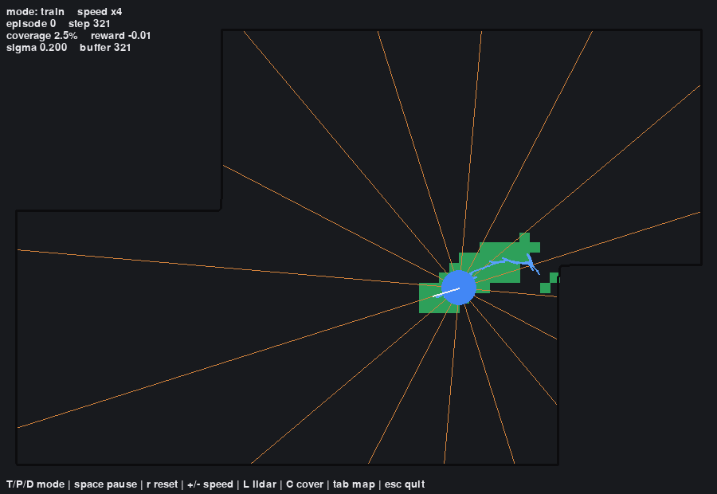
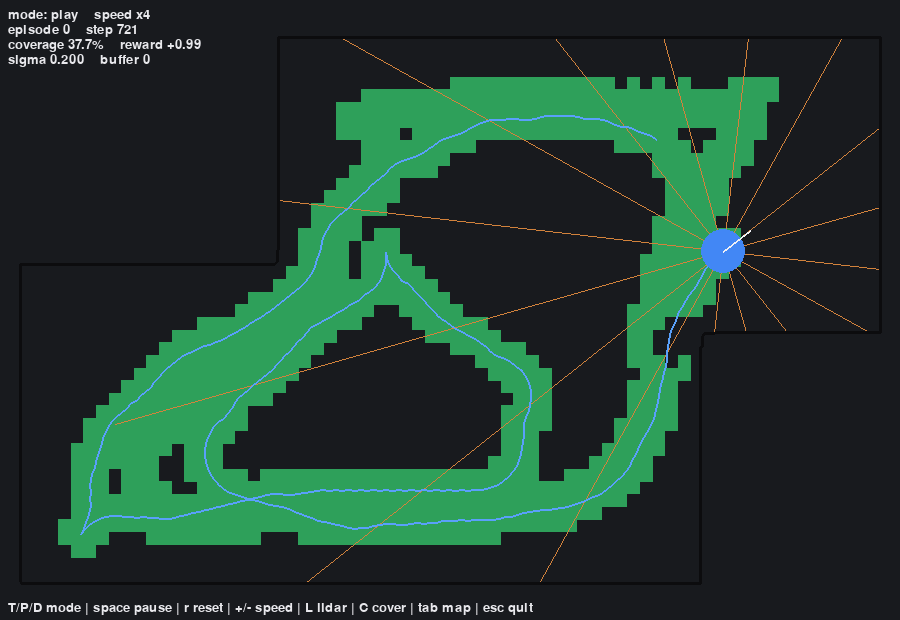
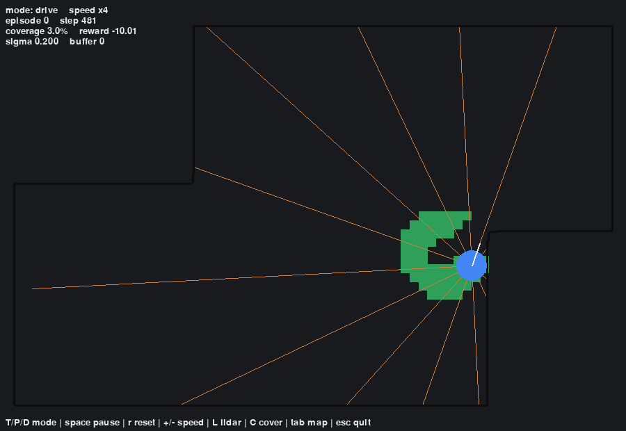
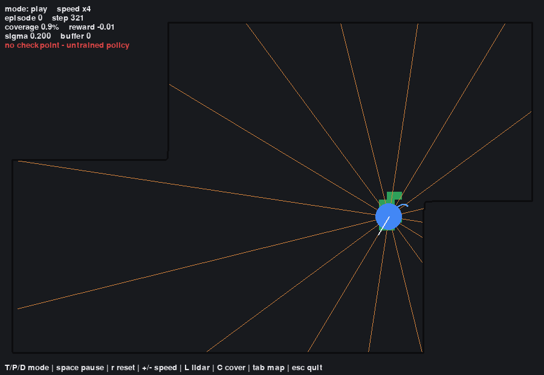

# UX — RoboVacuumDDPG (§10)

## 1. Verdict — §10 in scope (Pygame live viewer shipped)
RoboVacuumDDPG ships an interactive **Pygame GUI** (`scripts/play.py`,
`uv run python scripts/play.py`) — a single-window live viewer with three modes.
§10 (usability + Nielsen's heuristics + a screenshot of each state) is therefore
evaluated here. The CLI + static-figure surface (§6) remains for batch runs.

The GUI is a **presentation layer** (`src/gui/*`) that consumes the SDK only
(`sdk.live_session(...)` streams per-step `Frame`s); it never touches the
env/agent internals, so the single-entry architecture (§4) is preserved.

## 2. The three modes (with screenshots)

**TRAIN** — watch the DDPG agent learn live: the robot drives the current
episode, lidar rays + accumulating coverage are drawn, and the HUD shows
episode/step/coverage/reward/σ/buffer.

**PLAY** — load the committed demo checkpoint (`assets/demo_policy.pt`) and watch
the greedy trained policy sweep the room (~38% coverage in one episode).

**DRIVE** — take over with the arrow keys (↑/↓ throttle, ←/→ steer) and drive the
vacuum yourself to compare human vs learned control.

**No-checkpoint fallback** — if no trained checkpoint is present (e.g. a fresh
clone), PLAY falls back to a fresh agent and shows a red badge rather than
failing.

## 3. Controls reference
| Key | Action | Key | Action |
|---|---|---|---|
| `T` / `P` / `D` | Train / Play / Drive mode | `space` | pause / resume |
| `↑ ↓ ← →` | drive throttle/steer (DRIVE) | `r` | reset episode |
| `+` / `-` | speed up / down (1–50 steps/frame) | `L` | toggle lidar rays |
| `tab` | cycle map | `C` | toggle coverage shading |
| `s` | cycle seed | `esc` | quit |

## 4. Nielsen's 10 usability heuristics (mapped)
1. **Visibility of system status** — the HUD reports mode, episode, step,
   coverage %, reward, σ, and buffer size every frame; the reward curve updates live.
2. **Match to the real world** — spatial metaphor: blue disc = robot (with a
   heading line), green = cleaned floor, orange = lidar beams, black = walls.
3. **User control & freedom** — pause, reset, switch mode, or quit at any time;
   DRIVE lets the user override the policy.
4. **Consistency & standards** — OS-conventional keys (arrows to move, `space`
   pause, `esc` quit); one persistent controls hint along the bottom.
5. **Error prevention** — TRAIN/PLAY are read-only (no user action can corrupt
   the run); speed is clamped to [1, 50]; a missing checkpoint degrades to a
   labelled fallback instead of crashing.
6. **Recognition over recall** — the controls hint is always on screen, so no
   keybinding has to be memorised.
7. **Flexibility & efficiency** — power users get speed control, map/seed
   cycling, and overlay toggles; novices get working defaults (TRAIN, room_single).
8. **Aesthetic & minimalist design** — dark theme, only the essential overlays;
   lidar and coverage can be toggled off to declutter.
9. **Recognise, diagnose, recover from errors** — the red "no checkpoint —
   untrained policy" badge names the problem and the fix (provide a checkpoint);
   collisions are legible as reward drops in the HUD.
10. **Help & documentation** — the on-screen hint, the README quickstart, and
    this document.

## 5. Accessibility notes
- **Keyboard-only**: every action is bound to a key; no mouse needed.
- **Contrast**: the palette (blue / green / orange on a dark background) is chosen
  for high contrast. *Limitation:* state is partly colour-encoded — a future pass
  could add shape/pattern cues for colour-blind users.
- **Window**: fixed size (`gui.window_width`/`height` in `config/config.yaml`);
  not yet resizable — a documented limitation.

## 6. The batch surface (CLI + static figures, still present)
- **Single entry point** `RoboVacuumSDK` (`src/sdk/sdk.py`): `build_env`, `train`,
  `rollout`, `coverage_report`, `evaluate`, `trajectory`, `map_walls`,
  `coverage_grid`, `live_session`.
- **Scripts**: `scripts/{train,evaluate,render_learning_curve,render_critic_loss,
  render_trajectory,render_coverage_heatmap,sweep_n_rays,render_sensitivity}.py`.
- **Static figures** under `results/figures/` (learning curve, critic loss,
  trajectory, coverage heatmap, n_rays sensitivity).
